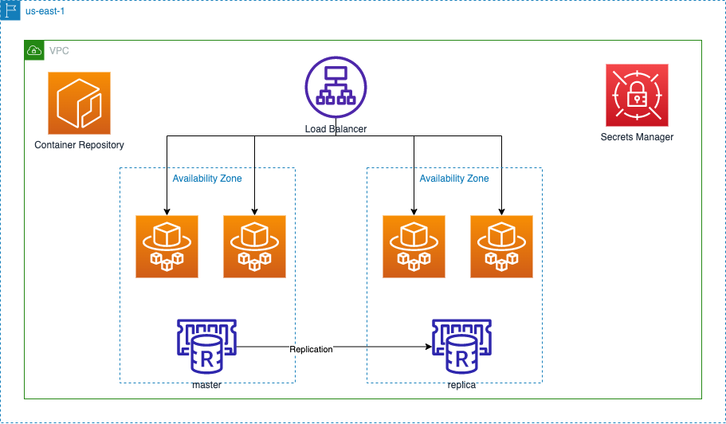

# Welcome to the infrastructure for the Yearn API repo!

This repo contains the infrastructure definition for the [Yearn API (cache)](https://github.com/yearn/yearn-api).

The infrastructure is defined using **[AWS Cloud Development Kit (AWS CDK)](https://aws.amazon.com/cdk/)**.
AWS CDK is an open source software development framework to define your cloud application resources using
familiar programming languages.

These definitions can then be synthesized to AWS CloudFormation Templates which can be deployed AWS.

## Infrastructure Diagram

Below is a visual representation of the infrastructure deployed by this repository.



[Source](https://drive.google.com/file/d/1EwfRPJ4xXlHJZmIlln2HMPakRbILoxbi/view?usp=sharing)

Notable components are:
1. A redis cluster set up in high availability mode. A hot standby running in a different availability zone is promoted to the master if the current master fails.
2. The service is hosted on Fargate containers running in multiple availability zones for high availability
3. An application load balancer spreads out incoming traffic amongst multiple containers running the application
4. An ECR container repository stores docker containers containing different versions of the application
5. A Secrets manager that stores API keys, passwords, etc

## Setting up the infrastructure

## Creating a new AWS user for CDK

It is best to create a new user when working with CDK instead of using a existing user with Admin or Root privileges.

Start by creating a new IAM policy which allows you to work with AWS CDK:

```json
{
    "Version": "2012-10-17",
    "Statement": [
        {
            "Action": [
                "cloudformation:*"
            ],
            "Resource": "*",
            "Effect": "Allow"
        },
        {
            "Condition": {
                "ForAnyValue:StringEquals": {
                    "aws:CalledVia": [
                        "cloudformation.amazonaws.com"
                    ]
                }
            },
            "Action": "*",
            "Resource": "*",
            "Effect": "Allow"
        },
        {
            "Action": "s3:*",
            "Resource": "arn:aws:s3:::cdktoolkit-stagingbucket-*",
            "Effect": "Allow"
        },
        {
            "Effect": "Allow",
            "Action": [
                "ssm:GetParameter"
            ],
            "Resource": "arn:aws:ssm:*:*:parameter/cdk-bootstrap/*"
        },
        {
            "Effect": "Allow",
            "Action": [
                "ecr:BatchCheckLayerAvailability",
                "ecr:BatchGetImage",
                "ecr:CompleteLayerUpload",
                "ecr:DescribeImages",
                "ecr:GetDownloadUrlForLayer",
                "ecr:GetRepositoryPolicy",
                "ecr:InitiateLayerUpload",
                "ecr:ListImages",
                "ecr:PutImage",
                "ecr:UploadLayerPart",
                "ecr:PutImageScanningConfiguration"
            ],
            "Resource": "arn:aws:ecr:*:<aws account id>:repository/aws-cdk/*"
        },
        {
            "Effect": "Allow",
            "Action": [
                "ecr:DescribeRepositories",
                "ecr:CreateRepository",
                "ecr:DescribeImages"
            ],
            "Resource": "arn:aws:ecr:*:<aws account id>:*"
        }
    ]
}
```

Then create a new IAM user and attach your new policy to this user.

**WARNING**:
Any user with this policy have a lot of privileges on AWS, so only add this policy to very trusted users. Once the initial deploy of the infrastructure is complete, consider removing this policy from all users.

### Bootstrapping

Follow the steps to bootstrap your AWS Account to work with AWS CDK:

1. [Prerequisites](https://docs.aws.amazon.com/cdk/latest/guide/getting_started.html#getting_started_prerequisites) 
2. [Install AWS CDK Locally](https://docs.aws.amazon.com/cdk/latest/guide/getting_started.html#getting_started_install)
3. [Bootstrapping](https://docs.aws.amazon.com/cdk/latest/guide/getting_started.html#getting_started_bootstrap)

The infrastructure in this repository requires a VPC with at least one public subnet. If you don't have a VPC that meets this criteria or want to provision a new VPC for this project, you can follow the instructions [here](https://docs.aws.amazon.com/AmazonECS/latest/developerguide/create-public-private-vpc.html).

### Creating the infrastructure

#### Dependencies

Install all the dependencies: `npm install`.

#### Create Services

Create all the support services used by the application:

```
CERTIFICATE_ARN="arn:aws:acm:us-east-1:11111111111:certificate/4939e960-18e2-3223-8783-d0bca0c636zq" cdk --profile "aws-profile-name" deploy YearnAPIStack/YearnAPIServicesStack
```

**NOTE**: `CERTIFICATE_ARN` should be the ARN of the AWS Managed Certificate for the domain this service will be hosted on

#### Update Secrets and Initial Container

Navigate to the [Secrets Manager](https://console.aws.amazon.com/secretsmanager/home?region=us-east-1#!/listSecrets/) and add the following secrets:

- `WEB3_HTTP_PROVIDER` - 
- `WEB3_HTTP_PROVIDER_FTM_PASSWORD` - 
- `WEB3_HTTP_PROVIDER_FTM_USERNAME` - 
- `WEB3_HTTP_PROVIDER_FTM_URL` - 
- `REMOTE_WRITE` - Prometheus ingestion URL
- `REMOTE_WRITE_USERNAME` - Prometheus ingestion username
- `REMOTE_WRITE_PASSWORD` - Prometheus ingestion password

Build and upload your first container to your ECR repository:

```
aws --profile aws-profile-name ecr get-login-password --region us-east-1 | docker login --username AWS --password-stdin <aws account id>.dkr.ecr.us-east-1.amazonaws.com
docker pull amazon/amazon-ecs-sample
docker tag amazon/amazon-ecs-sample <aws account id>.dkr.ecr.us-east-1.amazonaws.com/yearn-api-repo:latest
docker push <aws account id>.dkr.ecr.us-east-1.amazonaws.com/yearn-api-repo:latest
```

**Note:** Add your account id in the snippet above

#### Deploy the rest of the infrastructure

`cdk --profile "aws-profile-name" deploy --all`


The `cdk.json` file tells the CDK Toolkit how to execute your app.

## Useful commands

 * `npm run build`   compile typescript to js
 * `npm run watch`   watch for changes and compile
 * `npm run test`    perform the jest unit tests
 * `cdk deploy`      deploy this stack to your default AWS account/region
 * `cdk diff`        compare deployed stack with current state
 * `cdk synth`       emits the synthesized CloudFormation template
